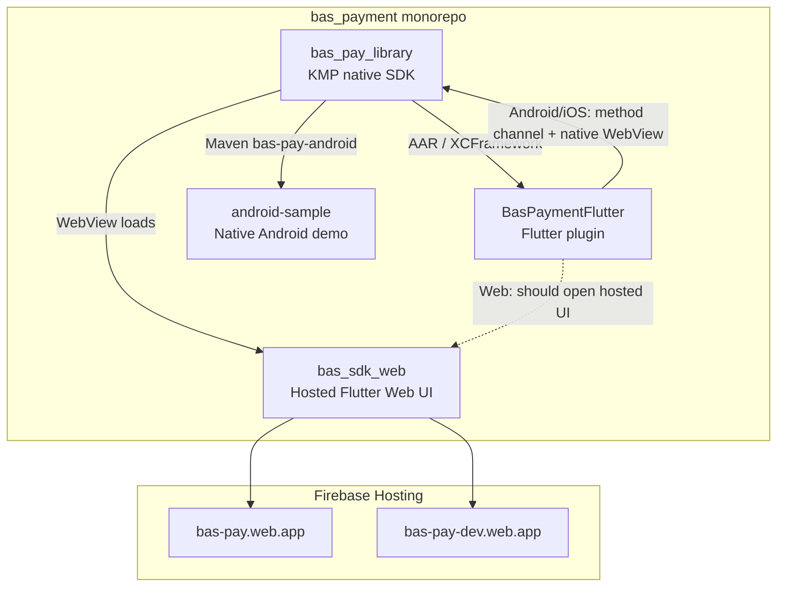
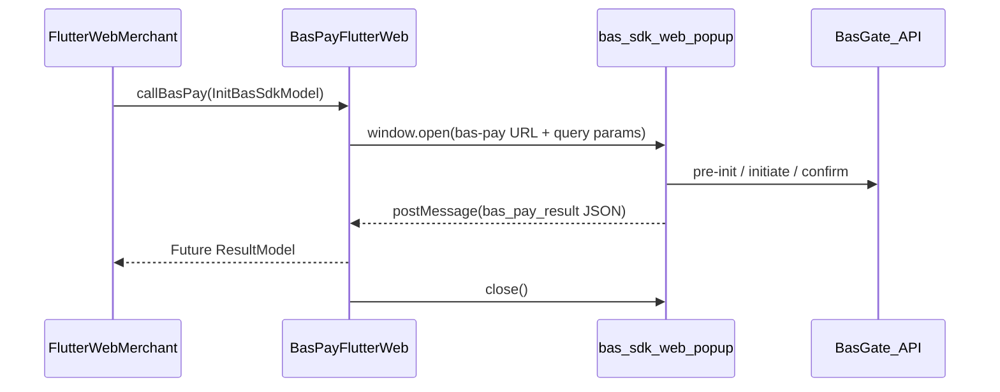

# Flutter Web BAS Payment SDK Plan

## How the projects relate



| Project                                                                                | Role                                                                                                                                                                             |
| -------------------------------------------------------------------------------------- | -------------------------------------------------------------------------------------------------------------------------------------------------------------------------------- |
| [`bas_pay_library`](C:\flutter\StudioProjects\ykb\bas\bas_payment\bas_pay_library)     | Source KMP SDK. Android/iOS embed a WebView that loads the hosted payment app and bridges JS (`initBasSdk`, `openBankyLitePayment`, `closeBasSdk`) to native Banky Lite.         |
| [`bas_sdk_web`](C:\flutter\StudioProjects\ykb\bas\bas_payment\bas_sdk_web)             | The actual payment UI (Flutter Web). Deployed to `bas-pay.web.app` / `bas-pay-dev.web.app`. Standalone web mode reads URL query params; embedded mode uses `window.kmpJsBridge`. |
| [`BasPaymentFlutter`](C:\flutter\StudioProjects\ykb\bas\bas_payment\BasPaymentFlutter) | Flutter plugin exposing `BasPayFlutter().callBasPay(model)`. Works on Android/iOS via method channel + bundled AAR. **Web is declared but not implemented.**                     |
| [`android-sample`](C:\flutter\StudioProjects\ykb\bas\bas_payment\android-sample)       | Reference native Android app using Maven `com.superstore:bas-pay-android` + local `BankySDKManager-release.aar`.                                                                 |

**Key architectural insight:** Mobile does not reimplement payment logic in Dart. It opens a WebView to the same hosted web app (`bas_sdk_web`) and uses a JS bridge for results. Flutter Web should follow the same pattern—not reimplement BasGate APIs in the plugin.

---

## Why you get the compile error

[`pubspec.yaml`](C:\flutter\StudioProjects\ykb\bas\bas_payment\BasPaymentFlutter\pubspec.yaml) declares a web plugin:

```yaml
web:
  pluginClass: BasPayFlutterWeb
  fileName: bas_pay_flutter_web.dart
```

Flutter generates `web_plugin_registrant.dart` calling `BasPayFlutterWeb.registerWith(registrar)`, but [`lib/bas_pay_flutter_web.dart`](C:\flutter\StudioProjects\ykb\bas\bas_payment\BasPaymentFlutter\lib\bas_pay_flutter_web.dart) is **entirely commented out**, so the class does not exist.

**Second blocker (you will hit this next):** [`lib/bas_pay_flutter_method_channel.dart`](C:\flutter\StudioProjects\ykb\bas\bas_payment\BasPaymentFlutter\lib\bas_pay_flutter_method_channel.dart) imports `dart:io`, and [`lib/bas_pay_flutter_platform_interface.dart`](C:\flutter\StudioProjects\ykb\bas\bas_payment\BasPaymentFlutter\lib\bas_pay_flutter_platform_interface.dart) eagerly imports the method-channel implementation. Web builds cannot compile `dart:io`.

---

## Recommended approach (your choice: popup + postMessage)

Do **not** port payment APIs into the plugin. Instead:

1. **`BasPayFlutterWeb.callBasPay`** opens a popup to the hosted SDK with query params (same contract as [`home_controller.dart` `initWeb`](C:\flutter\StudioProjects\ykb\bas\bas_payment\bas_sdk_web\lib\features\home\controllers\home_controller.dart)).
2. **`bas_sdk_web`** detects popup/embedded mode and, on payment exit, sends `postMessage` to `window.opener` with the same JSON shape mobile already uses (`status`, `message`, `result`, `code`).
3. **Plugin** listens for that message, completes the `Future`, closes the popup, and maps to existing [`ResultModel`](C:\flutter\StudioProjects\ykb\bas\bas_payment\BasPaymentFlutter\lib\models\result_model.dart).

This mirrors the native bridge (`closeBasSdk`) while keeping one payment UI codebase.



### URL contract (popup entry)

Build from [`InitBasSdkModel`](C:\flutter\StudioProjects\ykb\bas\bas_payment\BasPaymentFlutter\lib\models\init_bas_sdk_model.dart):

| Param                                               | Source                                         |
| --------------------------------------------------- | ---------------------------------------------- |
| `trxToken`                                          | required                                       |
| `userIdentifier`, `fullName`, `language`, `product` | optional                                       |
| `platform`                                          | `"Flutter"`                                    |
| `osType`                                            | `"Web"`                                        |
| `embedded`                                          | `"popup"` (new flag for postMessage exit path) |

Base URL from `environment`:
- `prod` → `https://bas-pay.web.app/`
- `dev` → `https://bas-pay-dev.web.app/`

### postMessage contract (new, shared constant)

```json
{
  "type": "bas_pay_result",
  "payload": {
    "status": true,
    "message": "...",
    "result": "...",
    "code": 200
  }
}
```

Validate `event.origin` against allowed hosted origins before accepting.

### Popup-close without result

If the user closes the popup manually, resolve with `(resultStatus: false, resultModel: null)` (same as a failed native call).

---

## Implementation phases

### Phase 1 — Make Flutter Web compile (BasPaymentFlutter only)

**Goal:** `flutter run -d chrome` in example app compiles.

Changes in [`BasPaymentFlutter`](C:\flutter\StudioProjects\ykb\bas\bas_payment\BasPaymentFlutter):

1. **Uncomment `web: ^1.1.1`** in [`pubspec.yaml`](C:\flutter\StudioProjects\ykb\bas\bas_payment\BasPaymentFlutter\pubspec.yaml).
2. **Implement `BasPayFlutterWeb`** in [`lib/bas_pay_flutter_web.dart`](C:\flutter\StudioProjects\ykb\bas\bas_payment\BasPaymentFlutter\lib\bas_pay_flutter_web.dart):
   - `registerWith` → `BasPayFlutterPlatform.instance = BasPayFlutterWeb()`
   - `callBasPay` → temporary `UnimplementedError` or no-op stub (enough to compile).
3. **Split platform implementations with conditional imports** to remove `dart:io` from web graph:
   - Add `lib/bas_pay_flutter_method_channel_stub.dart` (no `dart:io`) for web default, or use `import ... if (dart.library.io) ...`.
   - Update [`bas_pay_flutter_platform_interface.dart`](C:\flutter\StudioProjects\ykb\bas\bas_payment\BasPaymentFlutter\lib\bas_pay_flutter_platform_interface.dart) so web does not eagerly reference `MethodChannelBasPayFlutter` with `dart:io`.
4. **Guard `Platform.isAndroid`** in method channel behind `dart:io` import only on IO platforms.

**Verify:** `cd BasPaymentFlutter/example && flutter build web`

---

### Phase 2 — Plugin popup + listener (BasPaymentFlutter)

**Goal:** `callBasPay` opens popup and waits for message.

Add small focused files (keep [`bas_pay_flutter_web.dart`](C:\flutter\StudioProjects\ykb\bas\bas_payment\BasPaymentFlutter\lib\bas_pay_flutter_web.dart) thin):

- `lib/web/bas_pay_host_urls.dart` — prod/dev base URLs
- `lib/web/bas_pay_popup_bridge.dart` — `openPopup`, `listenForResult`, origin check, timeout, cleanup

`BasPayFlutterWeb.callBasPay` flow:
1. Build query URI from `InitBasSdkModel.toJson()` + `osType=Web` + `embedded=popup`
2. `window.open(url, 'bas_pay', features)` (must be triggered from user gesture in example app — already true for button press)
3. Register `window.onMessage` listener
4. On `bas_pay_result`, parse JSON → `ResultModel.fromJson` → return `(resultStatus: true, resultModel: ...)`
5. On popup closed / timeout → return failure tuple
6. Remove listener and close popup

**Verify:** popup opens hosted SDK; listener logs messages (before Phase 3 sends them).

---

### Phase 3 — Hosted SDK posts result back (bas_sdk_web)

**Goal:** popup can complete the merchant `Future`.

Changes in [`bas_sdk_web`](C:\flutter\StudioProjects\ykb\bas\bas_payment\bas_sdk_web):

1. Extend [`InitBasSdkModelProvider`](C:\flutter\StudioProjects\ykb\bas\bas_payment\bas_sdk_web\lib\common\providers\init_bas_sdk_model_provider.dart) with `isPopupEmbedded` (query param `embedded=popup`).
2. Add `lib/common/providers/host_bridge/host_result_bridge.dart`:
   - `notifyHost(ResultStatusModel)` → if popup mode and `window.opener != null`, `postMessage` with `bas_pay_result`
   - reuse existing `ResultStatusModel.toJson()` shape
3. Call bridge from [`result_status_model_provider.dart`](C:\flutter\StudioProjects\ykb\bas\bas_payment\bas_sdk_web\lib\common\providers\result_status_model_provider.dart) in `userExitFromSdk()` **before** redirect/close when `isPopupEmbedded`:
   - success, cancel, and error exits must all notify host
4. For popup mode, **skip** `permanentRedirect` / `window.close()` when opener exists (parent owns navigation).

**Deploy:** rebuild and deploy `bas_sdk_web` to dev hosting before end-to-end testing.

**Verify:** example Flutter web app receives real payment result in `callBasPay` Future.

---

### Phase 4 — Hardening and docs

- Origin allowlist: `bas-pay.web.app`, `bas-pay-dev.web.app`, `localhost` for local bas_sdk_web dev
- Popup-blocked UX: return clear error if `window.open` returns null
- Optional timeout (e.g. 30 min) with cleanup
- Document web-specific behavior in plugin README (popup requirement, deploy dependency on hosted SDK version)
- Example app: no code changes required beyond web build if button already calls `callBasPay`

---

## Code smells to address (ranked)

| Severity | Issue                                                | Fix in plan                                 |
| -------- | ---------------------------------------------------- | ------------------------------------------- |
| Critical | Web plugin declared but class commented out          | Phase 1                                     |
| Critical | `dart:io` in shared import path                      | Phase 1 conditional imports                 |
| Moderate | Default platform instance is mobile on all platforms | `registerWith` on web + conditional default |
| Moderate | No host→plugin result channel on web today           | Phase 2–3 postMessage                       |
| Minor    | `web` dependency commented out in pubspec            | Phase 1                                     |

---

## What we are intentionally not doing

- Bundling `bas_sdk_web` inside the plugin as a path dependency (large coupling, duplicate deploy)
- Reimplementing BasGate REST calls in the plugin
- Using full-page redirect as the primary API (breaks `Future` parity)
- iframe-first UI in merchant app (popup is simpler and matches user choice; iframe can be a later variant using same postMessage protocol)

---

## Test plan

1. `flutter build web` in `BasPaymentFlutter/example` — no `BasPayFlutterWeb` / `dart:io` errors
2. Click **Call Bas Pay** on Chrome — popup opens correct dev/prod URL with params
3. Complete or cancel payment — parent receives `postMessage`, `callBasPay` Future resolves
4. Close popup manually — Future returns failure without hanging
5. Regression: `flutter run` on Android/iOS example still works (conditional imports must not affect mobile)
